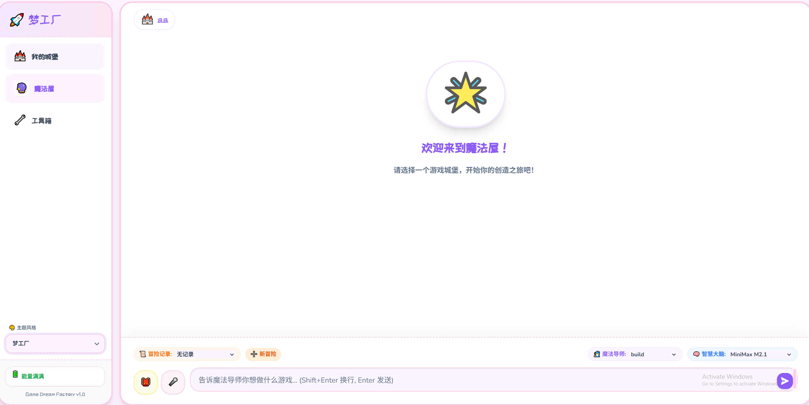

# 🎮 我的游戏梦工厂 (Kids OpenCode)

一个专为儿童设计的 AI 游戏开发工具，让孩子们通过对话轻松创建自己的游戏！



## 🚀 快速开始

### 1. 安装依赖

```bash
pip install -r requirements.txt
```

### 2. 安装 OpenCode

请参考 [OpenCode 官方文档](https://github.com/opencode-ai/opencode) 安装 OpenCode CLI 工具。

### 3. 启动应用

```bash
python web_builder.py
```

启动后会自动打开浏览器访问 `http://localhost:8686`

## ✨ 功能特点

- 🏰 **项目管理** - 创建、管理多个游戏项目
- 🔮 **AI 对话** - 与 AI 魔法导师实时对话创作
- 🎤 **语音输入** - 支持中文语音转文字
- 📎 **文件上传** - 上传图片等参考素材
- 🎭 **动漫名言** - 等待时显示经典台词
  - 🇨🇳 中文：火影忍者、海贼王、鬼灭之刃、进击的巨人、咒术回战...
  - 🇺🇸 英文：Disney (Frozen, Lion King)、Harry Potter、Marvel (Avengers)
- 🎨 **多主题** - 支持中英文主题切换（梦工厂、Disney Magic、Hogwarts、Marvel Heroes 等）

## 📝 许可证

MIT License
